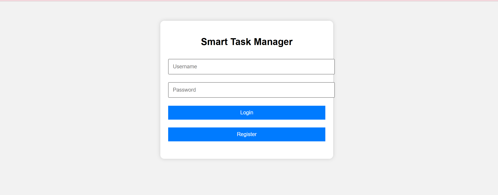
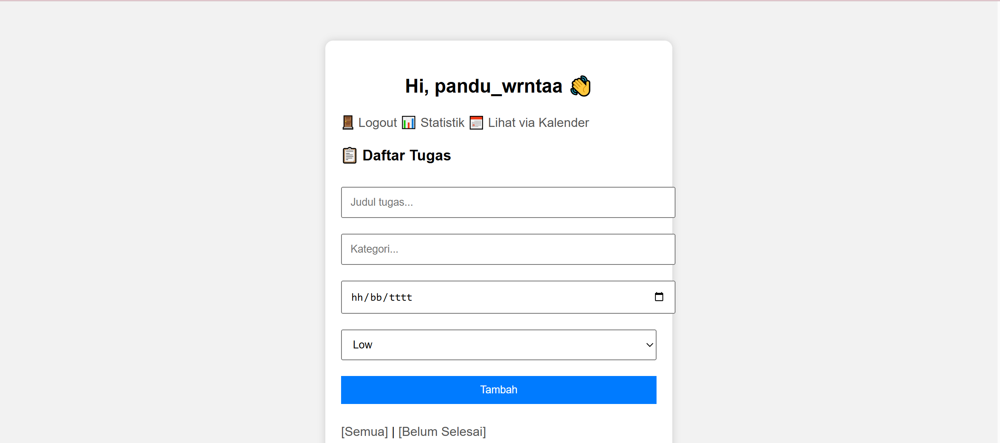
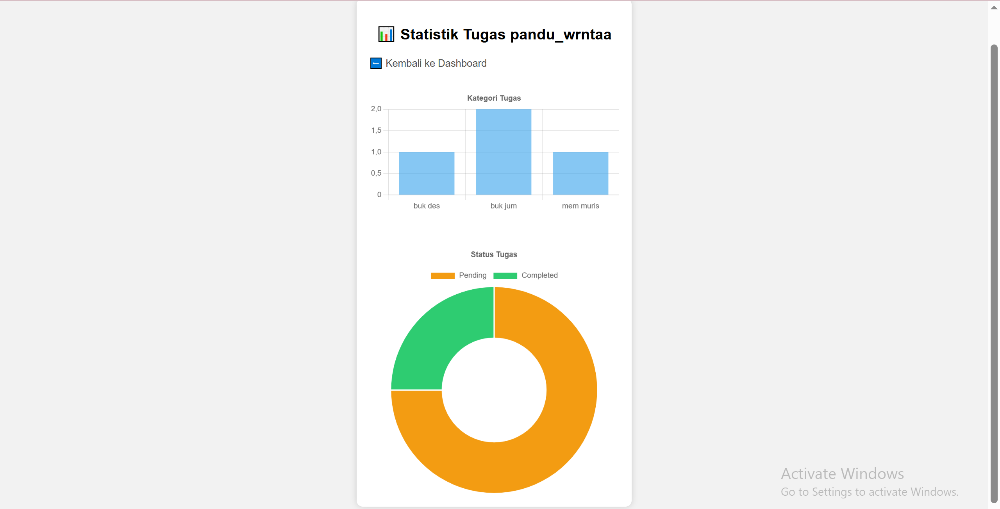

# ✅ Smart Task Manager (PHP + MySQL)

Aplikasi manajemen tugas sederhana berbasis web, cocok untuk latihan logika, CRUD, dan portofolio web development.

## 🔧 Fitur Utama

- 🔐 Login & Register user
- 📝 Tambah/Edit/Hapus tugas
- 🏷️ Kategori tugas
- ⏰ Deadline & Prioritas
- ✅ Tandai selesai
- 🔍 Filter tugas (semua / belum selesai)
- 📊 Statistik tugas (Chart.js)
- 📅 Kalender deadline (Flatpickr)
- 🚪 Logout aman

## 🖼️ Preview Tampilan

### Halaman Login

### Index

### Statistik

## 🛠️ Teknologi

- Frontend: HTML, CSS, JavaScript
- Backend: PHP Native
- Database: MySQL
- Grafik: Chart.js
- Kalender: Flatpickr.js

## 📂 Struktur Folder

smart-task-manager/
├── auth.php
├── db.php
├── index.php
├── tambah.php
├── edit.php
├── hapus.php
├── status.php
├── statistik.php
├── kalender.php
├── logout.php
├── style.css
└── db.sql

## 🚀 Cara Menjalankan

1. Import `db.sql` ke phpMyAdmin
2. Ubah `db.php` sesuai konfigurasi lokal (user/password/dbname)
3. Jalankan `auth.php` untuk login/register
4. Akses `index.php` untuk manajemen tugas

## 🧑‍💻 Dibuat Oleh

**Pandu Wiranata**  
Proyek ini dibuat untuk belajar dan memperkuat portofolio web development.

## 📄 Lisensi

Bebas digunakan untuk pembelajaran pribadi dan non-komersial.
